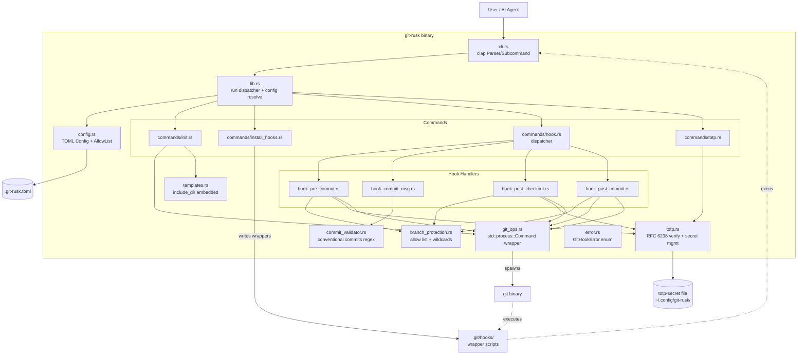

<!-- generated-by: gsd-doc-writer -->

# Architecture

## System Overview

**git-rusk** is a single-binary Rust CLI tool that hardens git repositories against
uncontrolled commits from AI coding agents. It installs git hooks that enforce three
layers of protection before any commit lands:

1. **Branch protection** — blocks commits to branches not on the configured allow list.
2. **Conventional commit enforcement** — validates every commit message against a
   configurable `type(scope): description` format with a mandatory `Description:` body.
3. **Optional TOTP human verification** — requires a time-based one-time password (RFC 6238)
   from the `TOTP_CODE` environment variable before commits or branch switches to protected
   branches, proving a human is authorizing the action.

The tool is driven by a TOML config file (`.git-rusk.toml`) and installs thin shell wrapper
scripts into `.git/hooks/` that delegate back to the `git-rusk hook <name>` subcommand.
Primary inputs are CLI arguments, the config file, and (when TOTP is enabled) the `TOTP_CODE`
environment variable; primary outputs are exit codes consumed by git (0 = proceed, non-zero =
block) and human-readable error messages on stderr. The architecture is a layered monolith:
a CLI dispatch layer over a library of pure validation and git-operations modules.

## Component Diagram



## Data Flow

### Commit flow (the core protection path)

When a user or AI agent runs `git commit`, git invokes the installed wrapper scripts in
sequence. Each wrapper is a one-line shell script: `exec git-rusk hook <name> "$@"`.

1. **`git commit` starts** → git fires `pre-commit`.
2. **`pre-commit` wrapper** → `git-rusk hook pre-commit` (`hook_pre_commit::run`):
   - Reads current branch via `git_ops::get_current_branch()`. Detached HEAD (`"HEAD"`)
     short-circuits with `Ok`.
   - Checks the branch against `config.branches.allowed` via
     `branch_protection::is_allowed_branch`. If not allowed, returns
     `CommitBlockedOnProtectedBranch` → non-zero exit → git aborts the commit.
   - If `config.totp.require_for_commit` is true, calls `totp::verify_from_env`, which reads
     `TOTP_CODE` from the environment and verifies it against the global secret file with
     tolerance for clock skew. Missing env var or invalid code → non-zero exit → abort.
3. **git fires `commit-msg`** with a path to the temporary message file →
   `git-rusk hook commit-msg <file>` (`hook_commit_msg::run`):
   - Reads the message file, delegates to `commit_validator::validate`.
   - The validator normalizes line endings, checks exemptions (Merge/Revert/fixup!/squash!/amend!),
     parses the header against a cached regex, enforces mandatory scope, validates type and
     scope against the `AllowList` config, and verifies the body starts with `Description:`
     and meets `min_body_length`. All errors are collected and returned together so agents
     can fix everything in one retry.
   - Any validation error → `CommitValidationFailed` → non-zero exit → git aborts.
4. **git creates the commit object.**
5. **git fires `post-commit`** → `git-rusk hook post-commit` (`hook_post_commit::run`):
   - If the current branch is allowed or is the default branch, does nothing.
   - Otherwise auto-checks out `config.branches.default_branch` to leave the user on a safe
     branch after an accidental commit on a protected branch. Checkout failure →
     `AutoReturnFailed` error.

### Branch switch flow

`git checkout <branch>` fires `post-checkout` with a branch-switch flag.

- `hook_post_checkout::run` ignores file checkouts (flag `0`).
- For branch switches (flag `1`): if the target is the default branch, short-circuits.
- If `config.totp.require_for_branch_switch` is true and the target branch is not on the
  allow list, verifies `TOTP_CODE` from the environment.

### Init flow

`git-rusk init [path] [--gitignore LANG]` (`commands::init::run`):

1. Resolves and canonicalizes the target path (creates it if missing).
2. Resolves config via `resolve_config` — explicit `--config` flag, else auto-discovers
   `.git-rusk.toml` in CWD, else `Config::default()`. `--default-branch` overrides the TOML.
3. `git_ops::init_repo` runs `git init` (idempotent), `ensure_main_branch` renames
   `master`→`main` (handling both unborn and born HEAD), `ensure_initial_commit` creates an
   empty initial commit with fallback local `user.name`/`user.email` and `--no-gpg-sign`.
4. Creates every branch in `branches.allowed` and `branches.protected` via
   `ensure_branch`, then checks out `branches.default_branch`.
5. Writes `README.md` (from embedded template, only if missing), `.gitignore` (from embedded
   language template unless `--gitignore none`, only if missing), and `.git-rusk.toml`
   (serialized config, only if missing). The `write_if_missing` helper makes `init`
   idempotent and non-destructive.

### TOTP secret management flow

`git-rusk totp init|show|reset` (`commands::totp`):

- The secret is **global per machine**, stored at `$XDG_CONFIG_HOME/git-rusk/totp-secret`
  (falling back to `$HOME/.config/git-rusk/totp-secret`), with strict `0o600` permissions
  enforced on write and verified on read. `load_secret` rejects any mode other than `0o600`.
- `init` generates a 160-bit CSPRNG secret via `totp_rs::Secret::generate_secret`, encodes it
  Base32, saves it, and prints the Base32 secret plus an `otpauth://` URI. Refuses to
  overwrite without `--force`. Accepts a manual `--secret` override.
- `show` re-derives the otpauth URI from the stored secret.
- `reset` rotates the secret (invalidating all prior codes); requires `--force`.

## Key Abstractions

| Abstraction | File | Purpose |
|---|---|---|
| `Cli` / `Command` / `HookAction` / `TotpAction` | `src/cli.rs` | clap derive definitions for all subcommands and hook actions. |
| `Config`, `BranchConfig`, `CommitConfig`, `TotpConfig` | `src/config.rs` | Strongly typed TOML config with `#[serde(default)]` for partial files. |
| `AllowList` (`All` / `Only`) | `src/config.rs` | Custom serde type that serializes `"all"` as a string and an explicit list as an array, enabling `types = "all"` or `types = ["feat","fix"]` in TOML. `allows()` is the membership check used throughout. |
| `GitHookError` | `src/error.rs` | `thiserror` enum covering config, git, TOTP, hook, and commit-validation failures with structured context fields. `exit_code()` maps every variant to exit code 1. |
| `ValidationError` | `src/commit_validator.rs` | `thiserror` enum with one variant per commit-message failure mode (InvalidHeader, MissingScope, InvalidType, InvalidScope, MissingBody, BodyMissingDescriptionPrefix, BodyTooShort). Display impls embed copy-pasteable examples and the allowed list. |
| `validate()` | `src/commit_validator.rs` | Collects **all** validation errors in one pass (returns `Vec<ValidationError>`) so AI agents can fix every issue in a single retry rather than one at a time. |
| `HEADER_RE` (`OnceLock<Regex>`) | `src/commit_validator.rs` | Lazily compiled regex for `type(scope)!: description`, compiled once and reused. |
| `is_allowed_branch()` | `src/branch_protection.rs` | Allow-list matching with `prefix/*` single-segment wildcard support (e.g. `hotfix/*` matches `hotfix/123` but not `hotfix/sub/123`). |
| `build_totp()` / `verify_code()` / `verify_from_env()` | `src/totp.rs` | TOTP construction from Base32 secret + config-derived skew, and code verification against system time. Skew = `backward_tolerance_secs / step_seconds`. |
| `secret_file_path()` / `load_secret()` / `save_secret()` | `src/totp.rs` | Global secret persistence with XDG resolution and `0o600` permission enforcement. |
| `git()` / `git_success()` | `src/git_ops.rs` | Thin `std::process::Command::new("git")` wrappers with `-C <path>` scoping and stderr capture. No libgit2 dependency. |
| `TEMPLATES` (`include_dir!`) | `src/templates.rs` | Compile-time embedding of the `templates/` directory tree so the binary has zero runtime file dependencies for README/.gitignore generation. |
| `run()` + `resolve_config()` | `src/lib.rs` | Top-level dispatch: load config (with CLI overrides), route to the matching command module. |

## Directory Structure

```
git-rusk/
├── src/
│   ├── main.rs                  # Binary entry point: parses CLI, calls lib::run, maps Result to ExitCode
│   ├── lib.rs                   # Library root: module declarations, run() dispatcher, config resolution
│   ├── cli.rs                   # clap derive definitions (Cli, Command, HookAction, TotpAction, InitArgs, GitignoreLang)
│   ├── config.rs                # TOML config structs + custom AllowList serde
│   ├── error.rs                 # GitHookError thiserror enum + exit_code()
│   ├── git_ops.rs               # std::process::Command wrappers around the system git binary
│   ├── branch_protection.rs     # Allow-list matching with prefix/* wildcards
│   ├── commit_validator.rs      # Conventional commit regex validation + ValidationError enum
│   ├── totp.rs                  # TOTP secret storage, RFC 6238 build/verify, env-var verification
│   ├── templates.rs             # include_dir! embedded README/.gitignore rendering
│   ├── hook_pre_commit.rs       # Branch protection + optional TOTP gate before commit
│   ├── hook_commit_msg.rs       # Reads msg file, delegates to commit_validator
│   ├── hook_post_checkout.rs    # Optional TOTP gate on branch switch to protected branch
│   ├── hook_post_commit.rs      # Auto-return to default branch after commit on protected branch
│   └── commands/
│       ├── mod.rs               # Re-exports the four subcommand modules
│       ├── init.rs              # `init` command: repo + branches + config + templates
│       ├── install_hooks.rs     # `install-hooks` command: writes .git/hooks/ wrapper scripts
│       ├── hook.rs              # `hook` command: dispatcher to the four hook handlers
│       └── totp.rs              # `totp init|show|reset` commands
├── templates/
│   ├── readme.md                # README template with {{PROJECT_NAME}} placeholder
│   └── gitignore/
│       ├── rust.gitignore
│       ├── python.gitignore
│       └── node.gitignore
├── tests/                       # Integration tests (init, totp, validate_commit, cli, verify_cli)
├── docs/                        # Project documentation
├── Cargo.toml                   # Package manifest (edition 2021, MSRV 1.74)
├── Cargo.lock                   # Pinned dependency versions
├── flake.nix                    # NixOS flake: crane-based build, rust-overlay toolchain, devShell
└── schema.json                  # Schema reference
```

**Rationale:** The project follows a strict separation between **command dispatch** (CLI +
`commands/`), **hook logic** (`hook_*.rs` files, one per git hook for traceability), and
**pure domain modules** (`branch_protection`, `commit_validator`, `totp`, `config`). Domain
modules have no I/O dependencies (except `totp.rs` for secret storage and `git_ops.rs` for
git) making them independently unit-testable — as reflected by the extensive inline
`#[cfg(test)]` modules. The hook handlers are intentionally thin: they orchestrate calls into
the domain modules and translate results into `GitHookError` variants. Templates are embedded
at compile time via `include_dir!` so the distributed binary is fully self-contained with no
runtime file lookups. Git operations shell out to the system `git` binary rather than linking
libgit2, keeping the build pure-Rust and NixOS-friendly.
